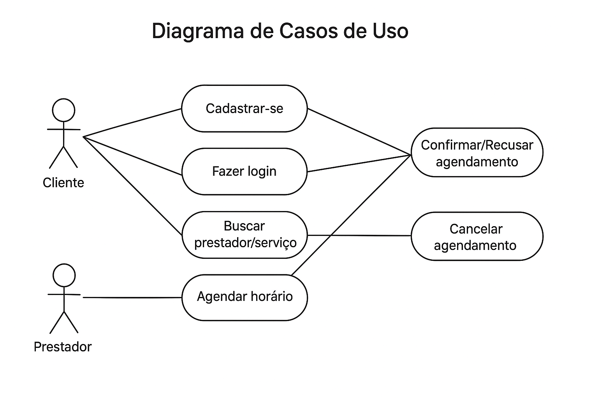

# Documento de Casos de Uso

## Lista dos Casos de Uso

- [CDU 01](#cdu-01-cadastrar-se-no-sistema): Cadastrar-se no sistema
- [CDU 02](#cdu-02-fazer-login-no-sistema): Fazer login no sistema
- [CDU 03](#cdu-03-buscar-prestador-servico): Buscar prestador/serviço
- [CDU 04](#cdu-04-agendar-horario): Agendar horário
- [CDU 05](#cdu-05-confirmar-recusar-agendamento): Confirmar/Recusar agendamento
- [CDU 06](#cdu-06-cancelar-agendamento): Cancelar agendamento

## Lista dos Atores

- Cliente  
- Prestador de serviço  
- Administrador  

## Diagrama de Casos de Uso

## Descrição dos Casos de Uso

### CDU 01 – Cadastrar-se no sistema

**Descrição:** O usuário (cliente ou prestador) realiza seu cadastro no sistema.

#### Atores

1. Cliente  
2. Prestador  

#### Fluxo Principal

1. Usuário acessa a tela de cadastro.  
2. Informa dados obrigatórios (nome, e-mail, senha e tipo de perfil).  
3. Sistema valida as informações.  
4. Sistema confirma cadastro e disponibiliza acesso.  

#### Fluxo Alternativo A

1. Dados inválidos → Sistema informa erro e solicita correção.  

---

### CDU 02 – Fazer login no sistema

**Descrição:** O usuário acessa sua conta no sistema.

#### Atores

1. Cliente  
2. Prestador  

#### Fluxo Principal

1. Usuário acessa a tela de login.  
2. Informa e-mail e senha.  
3. Sistema valida as credenciais.  
4. Sistema libera acesso ao painel correspondente.  

#### Fluxo Alternativo A

1. Senha incorreta → Sistema informa erro e permite nova tentativa.  

---

### CDU 03 – Buscar prestador/serviço

**Descrição:** O cliente busca prestadores de serviços disponíveis.

#### Atores

1. Cliente  

#### Fluxo Principal

1. Cliente acessa a tela de busca.  
2. Informa serviço ou nome do prestador.  
3. Sistema apresenta lista de prestadores compatíveis.  
4. Cliente visualiza disponibilidade.  

#### Fluxo Alternativo A

1. Nenhum prestador encontrado → Sistema exibe mensagem “nenhum resultado”.  

---

### CDU 04 – Agendar horário

**Descrição:** O cliente agenda um serviço com um prestador.

#### Atores

1. Cliente  
2. Prestador  

#### Fluxo Principal

1. Cliente seleciona prestador e serviço.  
2. Sistema mostra horários disponíveis.  
3. Cliente escolhe horário e confirma agendamento.  
4. Sistema registra o agendamento como “Pendente”.  
5. Sistema envia notificação ao prestador.  

#### Fluxo Alternativo A

1. Horário indisponível → Sistema sugere novos horários.  

---

### CDU 05 – Confirmar/Recusar agendamento

**Descrição:** O prestador confirma ou recusa o agendamento solicitado.

#### Atores

1. Prestador  

#### Fluxo Principal

1. Prestador acessa a lista de agendamentos pendentes.  
2. Seleciona o agendamento.  
3. Prestador confirma ou recusa.  
4. Sistema atualiza status e notifica cliente.  

#### Fluxo Alternativo A

1. Prestador sugere novo horário → Cliente pode aceitar ou recusar.  

---

### CDU 06 – Cancelar agendamento

**Descrição:** Cliente ou prestador pode cancelar agendamento confirmado.

#### Atores

1. Cliente  
2. Prestador  

#### Fluxo Principal

1. Usuário acessa o agendamento.  
2. Solicita cancelamento.  
3. Sistema remove reserva e libera o horário.  
4. Sistema notifica o outro usuário.  

#### Fluxo Alternativo A

1. Cancelamento fora do prazo permitido → Sistema informa regras (ex.: multa).  
